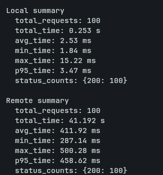
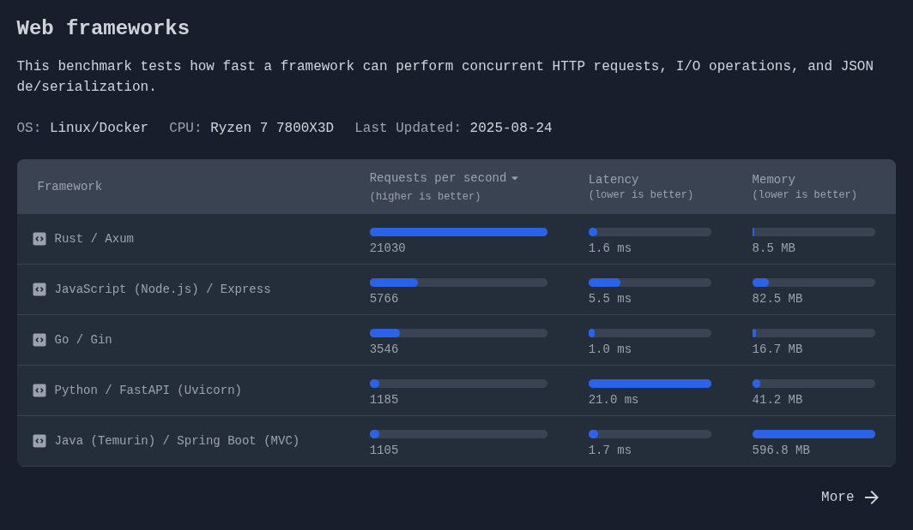

# Edge Node HTTP service
Lightweight edge HTTP service written in Rust that ingests sensor data, validates it, and computes a rolling moving average over the latest 10 readings. It exposes a single POST /data endpoint with strict schema and threshold checks, returning deterministic errors and fast responses. Designed for low-latency local processing with minimal memory usage, outperforming remote processing in benchmark tests.
## What this service does

This service receives sensor readings over HTTP, validates them, and returns a moving average.

### One endpoint: `POST /data`
1. Accepts JSON payloads with:
	- `sensor_id` (string)
	- `value` (number)
	- `timestamp` (UTC format: `YYYY-MM-DDTHH:MM:SSZ`)
2. Validates incoming data:
	- Requires `Content-Type: application/json`
	- Rejects malformed or schema-invalid JSON
	- Ensures `timestamp` matches the required UTC format
	- Ensures `value` is within configured `min_threshold` and `max_threshold`
3. Maintains an in-memory rolling window of the latest 10 values
4. Returns a successful response with:
	- `moving_average`: average of the rolling window
	- `timesamp`: server timestamp when the response is created


### Response behavior

- `200 OK`: data accepted and processed
- `400 Bad Request`: malformed JSON or wrong JSON structure
- `415 Unsupported Media Type`: missing/invalid `Content-Type`
- `422 Unprocessable Entity`: timestamp/value validation failed
- `500 Internal Server Error`: unexpected extraction/processing error

### Configuration

The service reads `config.json` at startup for:

- `ip` and `port` to bind the HTTP server
- `min_threshold` and `max_threshold` for value validation

#### OpenAPI documentation available in **openapi** folder

## Prerequisites

### For running this service:
- Docker and Docker Compose (required to run with `docker compose up`)

### For compiling from source:
- Rust toolchain for local builds (`rustc` + Cargo)

### For running benchmark
- Python 3 (required to run `benchmark.py`)

## Installation guide
1. Clone the repository

```bash
git clone https://github.com/proxjega/edge_node_http_service.git
cd edge_node_http_service
```

2. Configure `config.json`

Edit `config.json` and set these values for your environment:

- `ip`: interface to bind the server (for Docker, keep `0.0.0.0`)
- `port`: HTTP port exposed by the service
- `min_threshold`: minimum accepted sensor value
- `max_threshold`: maximum accepted sensor value

Example:

```json
{
	"ip": "0.0.0.0",
	"port": 8080,
	"min_threshold": -40,
	"max_threshold": 50
}
```

3. Start the service with Docker Compose

```bash
docker compose up --build
```

## Benchmark
The service was benchmarked to explain, why processing locally is actually better than sending data to a remote server, using real numbers. See `benchmark.py` script.
Benchmark:
1. Sends 100 correct requests with random temperaturs to first (local) container and measures their time
2. Enables tc netem to add artificial network latency (delay 100ms, jitter 20ms) 
3. Sends 100 correct requests with random temperatures to second ("remote") container and measures their time
4. Disables tc netem
5. Outputs results
### Results of benchmark:

- Both container successfully processed all data.
- Local processing is much faster, than sending data to a remote server: 2.53 ms vs 411.92 ms (~163 times faster).
- Latency range: In local: ~13 ms, in remote: ~213 ms
- Tail latency is also much better locally: p95 3.47 ms vs 458.62 ms remote (about 132x improvement).
#### Conclusion:
Local processing is much faster. 
#### What simulation does not capture compared to a real-world deployment:
- When sending data to remote server, there is a possibility for packet loss and for losing access for the network. So the real results may be worse.
- Big amounts of data sent to one server from many sensors may slow down processing speed.
- There was almost no logging in this service, in real-world applications middleware like logging or monitoring can increase latency.
- No HTTPS: TLS handshakes increase latency (although if the service is behind a reverse proxy, it is not required)  
#### Conclusion: In real-world deployment latency will be worse.
### Everything was tested on this specs:
- CPU - AMD Ryzen 7 7735HS (16) @ 4.83 GHz
- RAM - 16 GB
- Disk - SSD disk
- OS - Arch Linux x86_64

## Architecture
### Programming language:
The service was built using Rust. Why? Because:
- **It is fast.** If we need low latency and fast processing, rust is the best choice for this.
<br></br>
  
source: https://sharkbench.dev/  
<br></br>
- **Low memory usage.** Service can be deployed on small devices. 2 running containers  use ~7MB RAM:
<br></br>
  
<br></br>
### Processing logic
The processing logic is described above, in [What this service does](#what-this-service-does) section. Reasons: 
- **Safety:** strict request validation and threshold checks prevent invalid sensor data from affecting results, for example a faulty sensor reporting extreme values.
- **Bounded resource usage:** the rolling window is capped at 10 values, so memory use stays predictable over time.
- **Clear failure modes:** parsing and validation are separated from computation, so clients get deterministic errors and debugging is simpler.
- **Concurrency-safe state:** shared state is protected during updates, so concurrent requests do not corrupt the rolling window.
- **Performance:** Rust and the chosen architecture keep overhead low and latency predictable for edge workloads.

## Retrospective
- I was suprised by local processing speed. For one request it is ~50 microseconds (from getting request to sending response).
- I was also suprised by rust. It is my first time working with this language, and it is suprisingly understandable and convenient for a systems language. Also the web framework axum is quite nice.
- It was hard to understand rust macros and error handling at first, but with the help of AI I managed to do it.

## Next Steps
- Change and increase the logging from stdout to a file / database / other logging service, so it would be easier to debug the crashes.
- More processing: I am not sure that 10 values moving average is meaningful enough in real code.
- Authentication and authorization: so the requests will come from trusted sources (or use reverse proxy that will manage this).
- Make moving average per sensor, not one for all sensors.
- Use timestamp from request somewhere (maybe in logging) - its read, but not used in the code.
